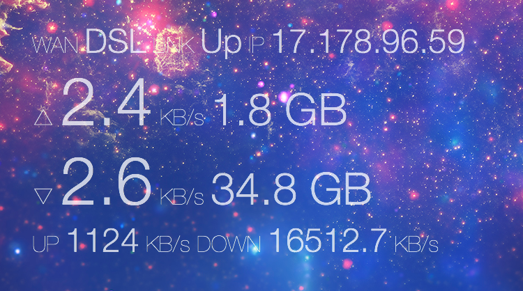

fritzbox-widget
==========================

A simple [Übersicht](http://tracesof.net/uebersicht/) Widget. This will show utilization on AVM Fritzbox routers.

> Please note: this widget needs the [CORS proxy modifications](https://github.com/felixhageloh/uebersicht/pull/253) to Übersicht.
> A [modified Übersicht app](https://zuckschwerdt.org/Uebersicht-1.0.44_CORS-Proxy.app.zip) is available for testing until upstream integrates this feature.

## Screenshot

## Download

Download just the [zipped widget](https://github.com/zuckschwerdt/fritzbox-widget/raw/master/fritzbox.widget.zip) folder, or check out this repository to your Übersicht widgets folder.

## Contributing

Have an idea for improving this widget? [Open an issue](https://github.com/zuckschwerdt/fritzbox-widget/issues/new) or fork this repository and send a pull request :grinning:.

## License

[CC0 1.0 Universal](./LICENSE)
